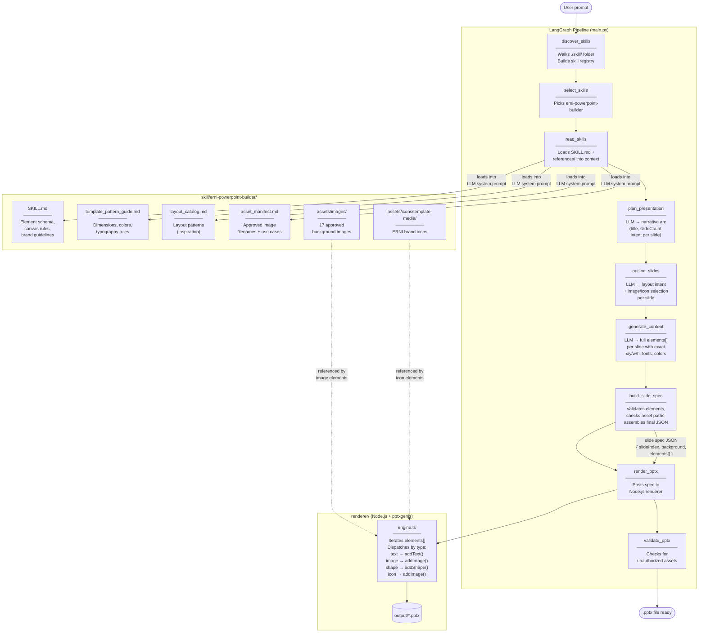

# PPTX Generator Demo

LLM-powered PowerPoint generation. The LLM composes every slide element (positions, fonts, colors) guided by skill reference docs — no hardcoded layouts.

---

## How it works



---

## Slide spec format

The LLM generates a JSON spec that the renderer translates directly to pptxgenjs calls:

```json
{
  "metadata": { "title": "My Deck", "output": "./output/My_Deck.pptx" },
  "slides": [
    {
      "slideIndex": 1,
      "background": { "color": "FFFFFF" },
      "footer": true,
      "elements": [
        { "type": "image", "src": "images/orange-wave-70.jpg", "x": 6.67, "y": 0, "w": 6.66, "h": 7.5, "sizing": { "type": "cover", "w": 6.66, "h": 7.5 } },
        { "type": "text", "content": "Title Here", "x": 0.8, "y": 2.4, "w": 5.5, "h": 1.8, "fontSize": 36, "color": "033778", "bold": true },
        { "type": "shape", "shape": "ellipse", "x": 1.0, "y": 4.0, "w": 0.5, "h": 0.5, "fill": "00AADB" }
      ]
    }
  ]
}
```

**Canvas:** 13.33" × 7.5" (LAYOUT_WIDE) | **Font:** Source Sans Pro | **Footer:** auto-rendered

---

## Element types

| Type | Key fields |
|------|-----------|
| `text` | `content`, `x y w h`, `fontSize`, `color`, `bold`, `align`, `valign` |
| `image` | `src` (`images/<file>`), `x y w h`, `sizing` |
| `shape` | `shape` (rect/ellipse/line), `x y w h`, `fill`, `line` |
| `icon` | `src` (`icons/template-media/<file>`), `x y w h` |

---

## Configuration

| Variable | Default | Description |
|----------|---------|-------------|
| `LLM_MODEL` | `gpt-4o` | Any OpenAI model (e.g. `chatgpt-5`) |
| `LLM_TEMPERATURE` | _(unset)_ | Omit for models that don't support it (e.g. GPT-5) |
| `RENDERER_URL` | `http://localhost:3001` | Node renderer URL; falls back to subprocess if unreachable |

Set in `.env` or as shell variables.

---

## Branches

| Branch | Description |
|--------|-------------|
| `hardcoded_renderer` | Original: 16 hardcoded layout functions, fixed LAYOUT_MAP |
| `dynamic_renderer` | Current: LLM generates all element positions; renderer is a pure JSON→pptxgenjs translator |

---

## Quick start

```bash
# 1. Start the renderer server
cd renderer
npx tsx src/server.ts

# 2. Run the pipeline
python main.py "Create a 10-slide deck about ERNI's digital transformation services"
```

**Use a different model:**
```bash
LLM_MODEL=chatgpt-5 python main.py "Create a capability deck"
```

**Renderer only (no LLM):**
```bash
cd renderer
npx tsx src/cli.ts render --input test-spec.json
```

**Validate a generated deck:**
```bash
cd renderer
npx tsx src/cli.ts validate ../output/My_Deck.pptx
```

---

## File structure

```
PPTX-generator-demo/
├── main.py                          # LangGraph pipeline
├── state.py                         # AgentState TypedDict
├── skill/erni-powerpoint-builder/
│   ├── SKILL.md                     # LLM system prompt (element schema, brand rules)
│   ├── references/
│   │   ├── layout_catalog.md        # Layout patterns (LLM guidance)
│   │   ├── template_pattern_guide.md# Canvas dimensions, colors, typography
│   │   └── asset_manifest.md        # Approved images + use cases
│   ├── assets/images/               # 17 approved background images
│   └── assets/icons/template-media/ # ERNI brand icons
└── renderer/
    ├── src/
    │   ├── render/
    │   │   ├── engine.ts            # Element renderer (text/image/shape/icon)
    │   │   ├── index.ts             # Slide renderer (background + footer)
    │   │   ├── renderPresentation.ts# Top-level orchestration
    │   │   └── helpers.ts           # Asset path resolution, footer
    │   ├── types/slideSpec.ts       # Zod schema for element-based spec
    │   ├── config/theme.ts          # ERNI theme constants
    │   ├── cli.ts                   # CLI interface
    │   └── server.ts                # Express HTTP server
    └── test-spec.json               # Sample element-based spec for testing
```
